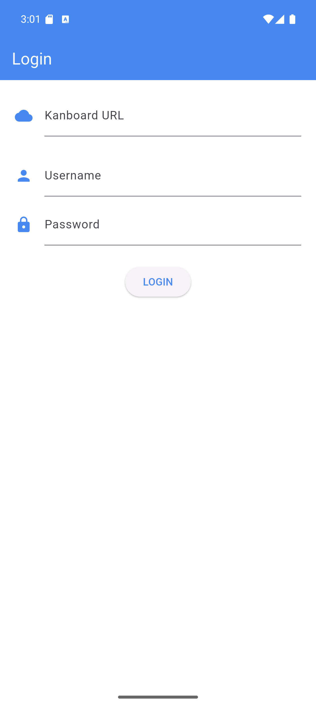
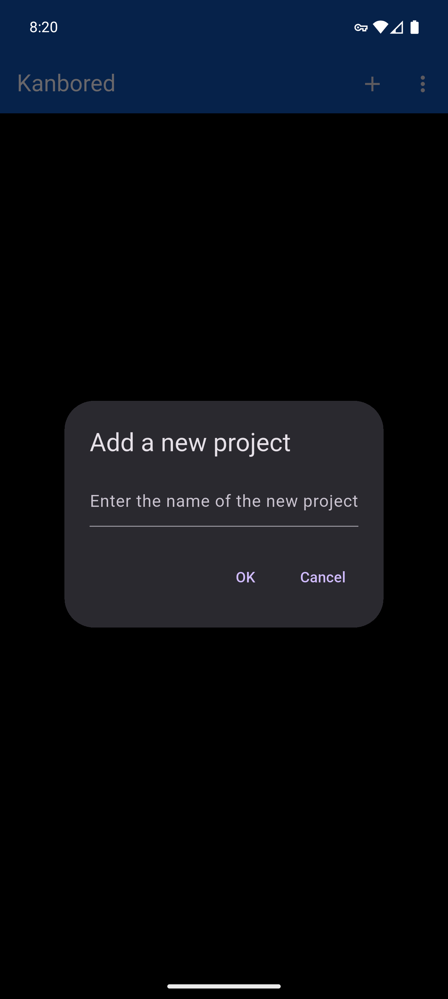
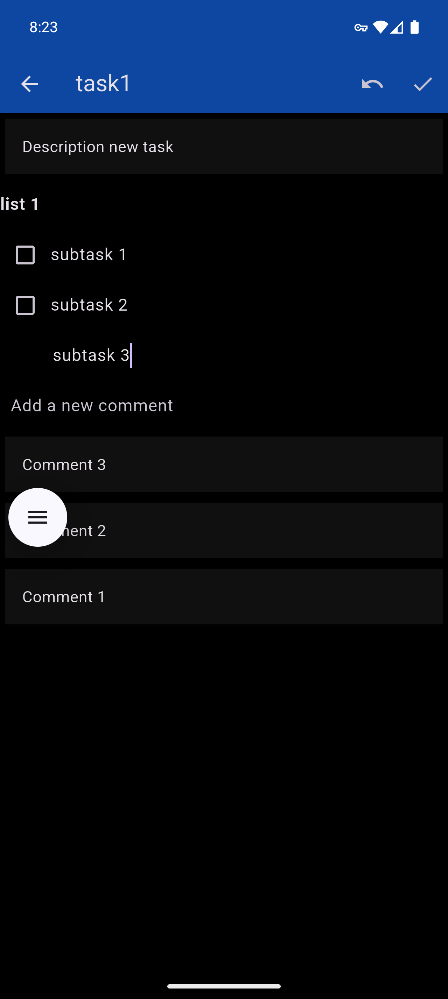
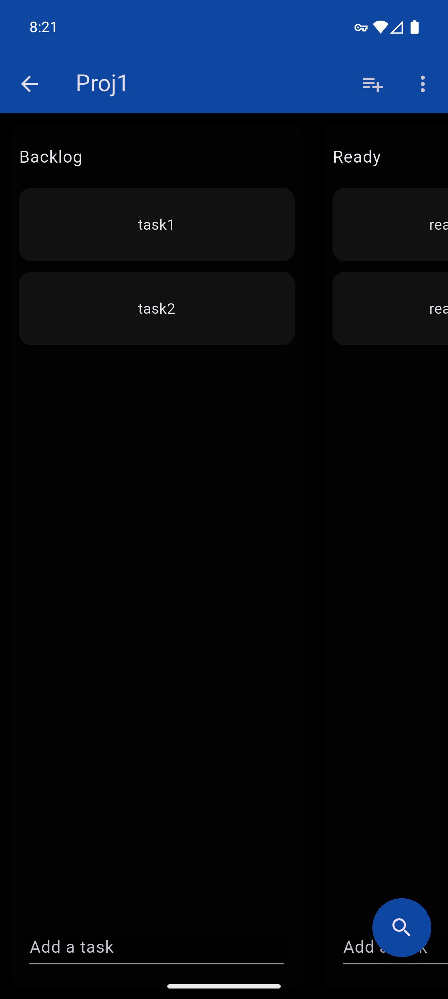
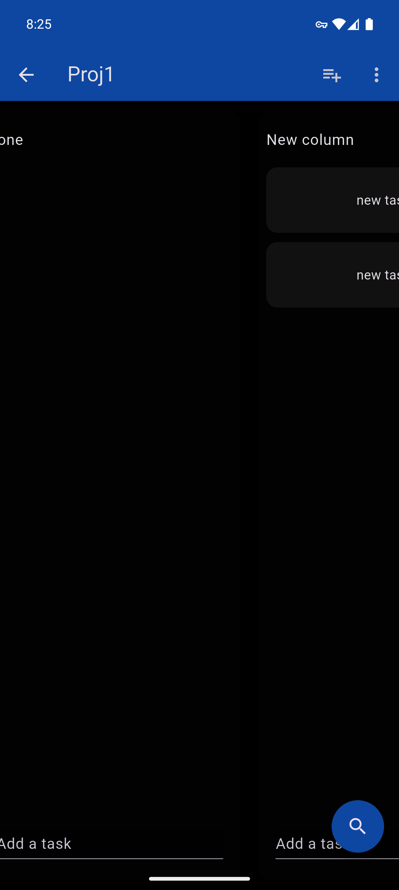
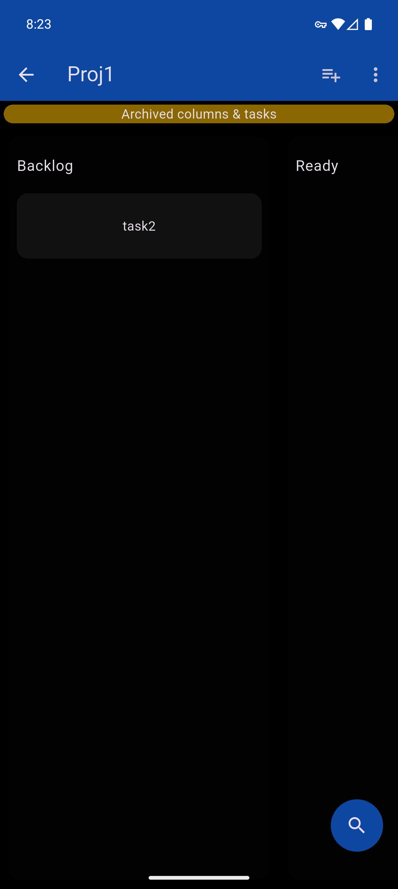
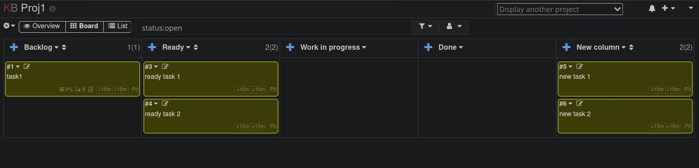

# kanbored

A WIP Flutter kanban board with front-end inspired by Trello, with experimental support for offline cache, and intention to work alongside a self-hosted Kanboard server.

Trello data can be converted to Kanboard data using [this fork](https://github.com/KishanPRao/TrelloJSON2Kanboard/tree/feature/additional-trello-features) to include checklist information.

The intention of this project is to support Trello's named checklists better, making use of metadata to store this additional information, and to be able to host your data privately.

For a rough idea about the features that are yet to be supported, please take a look at the [TODO file](TODO.md).

## Screenshots

| Login                                                                                                    | Add Project                                                                                                 | Task Information                                                                                             |
|----------------------------------------------------------------------------------------------------------|-------------------------------------------------------------------------------------------------------------|--------------------------------------------------------------------------------------------------------------|
| 

 | 

 | 

 |

| Project Information                                                                                        | New Column                                                                                                    | Archived task                                                                                                    |
|------------------------------------------------------------------------------------------------------------|---------------------------------------------------------------------------------------------------------------|------------------------------------------------------------------------------------------------------------------|
| 

 | 

 | 

 |

| Kanboard server                                     |
|-----------------------------------------------------|
|  |
