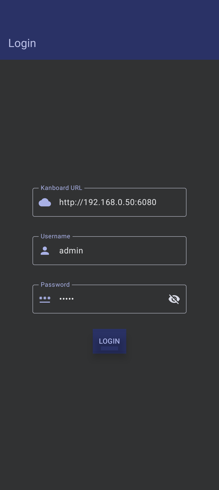
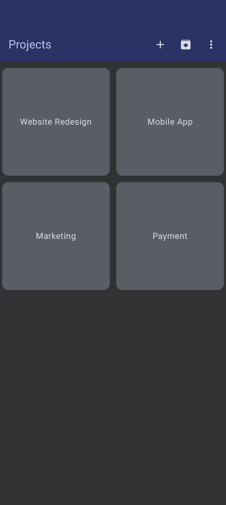
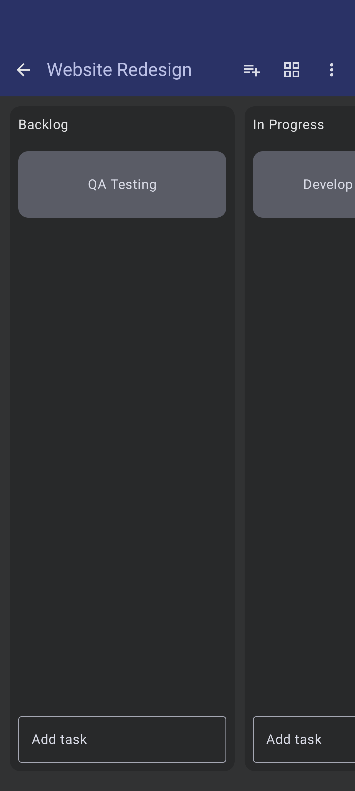
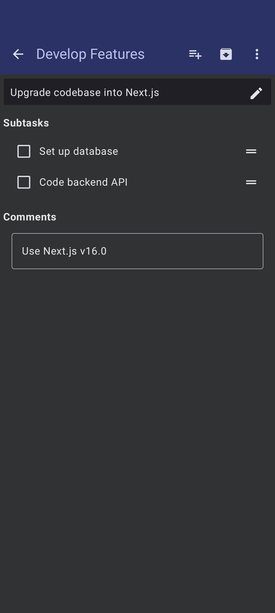
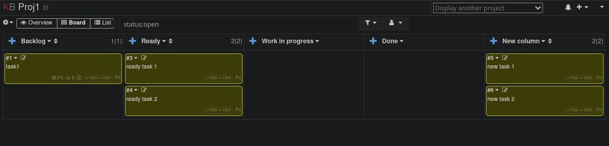

# Kanbored

A Kanban cross-platform application (Kotlin Compose, Android first), with support for offline cache, and intended to work alongside a self-hosted Kanboard server.

Trello data can be converted to Kanboard data using [this fork](https://github.com/KishanPRao/TrelloJSON2Kanboard/tree/feature/additional-trello-features) to include checklist information.

The intention of this project is to support Trello's named checklists with Kanboard, while being able to host your data privately.

The [ROADMAP](ROADMAP.md) file shows some of the features that are supported, and yet to be supported.

## Screenshots

| Login                                                                                              | Projects                                                                                                 |
|----------------------------------------------------------------------------------------------------|----------------------------------------------------------------------------------------------------------|
| 

 | 

 |

| Project Information                                                                                                 | Task Information                                                                                 |
|---------------------------------------------------------------------------------------------------------------------|--------------------------------------------------------------------------------------------------|
| 

 | 

 |

| Kanboard server                                     |
|-----------------------------------------------------|
|  |